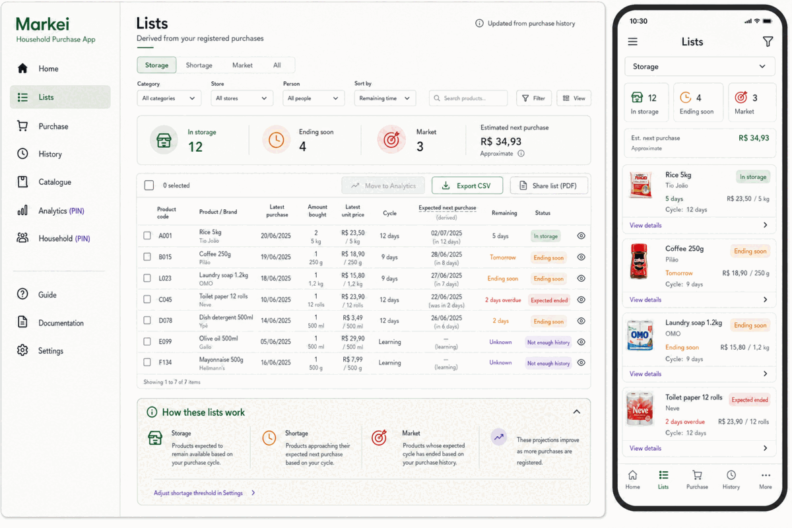
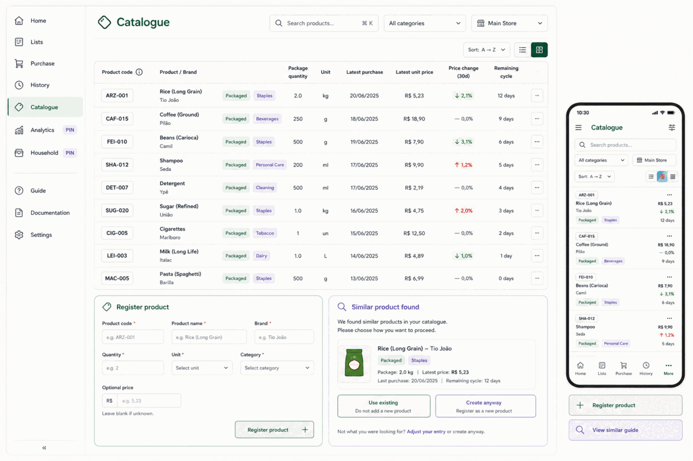
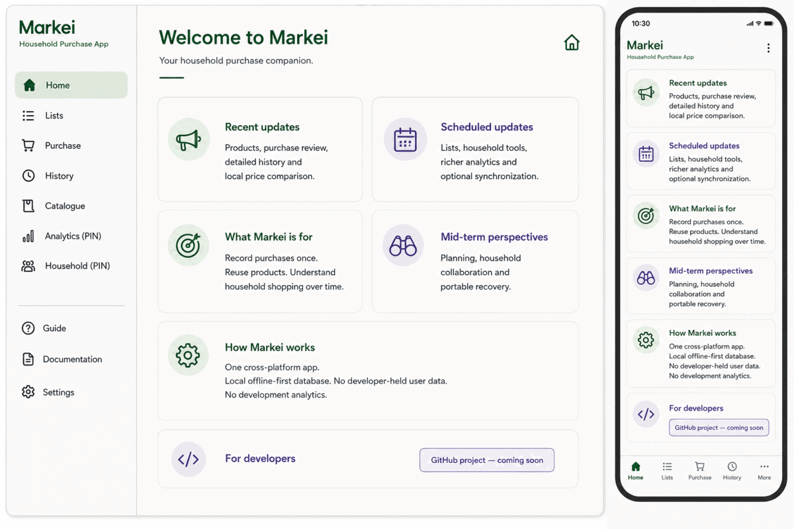
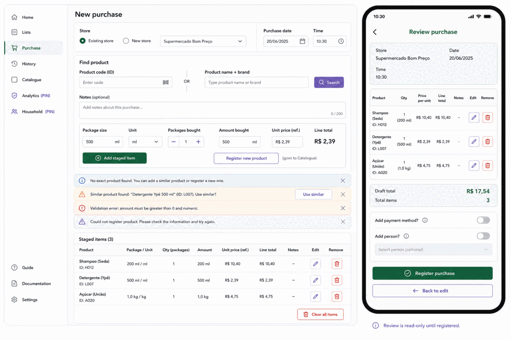
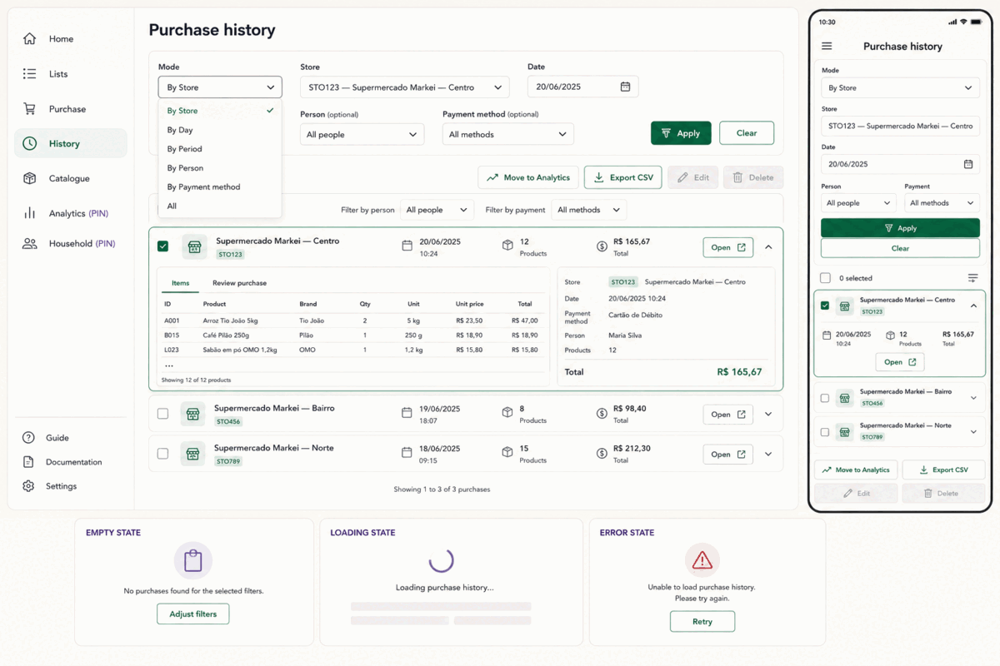

# E_DDC_STAGE — Cycle 09 Sprint 02 Semantic, UX and Accessibility Contract

> Sequence: FLX-ORD-01 — Main-approved materialization
> Unit: C09-S02 — Functional correction and UI convergence
> Status: ACTIVE — CONTROLLING ONLY WITH D/F
> Branch: `intermid-cycle-recovery`
> Report: replace `DEV_STAGE/H_DDC_CODEX.md`

## 1. Methodology and authority

Codex must complete the executive-context boot named in D before source inspection or
mutation. This E controls visible meaning, terminology, interaction semantics, recovery
language and accessibility equivalence. It does not authorize learner-maturity changes,
permanent Didactic promotion or claims unsupported by G/H/I evidence.

## 2. Attached target evidence

Inspect all five files before writing page copy or responsive compositions:











The images define accepted communication intent: hierarchy, grouping, action priority,
desktop/mobile information parity, selection feedback and explicit states. Exact copy,
colors, spacing and decoration may change for truthfulness, accessibility and real data.

## 3. Stable conceptual distinctions

Implementation, copy and tests must preserve:

```text
internal UUID ≠ visible organizational code ≠ nickname
Product code ≠ Product UUID ≠ normalized exact identity
exact code match ≠ exact identity match ≠ advisory similarity
select Product ≠ view Product details ≠ add staged Item
Product facts ≠ Purchase Item facts
buying moment ≠ insertion/upsertion moment
PACKAGED package quantity ≠ packages bought ≠ amount bought
BULK amount bought ≠ price per the same selected unit ≠ calculated line total
registered Purchase facts ≠ Lists estimates ≠ measured inventory
generated PDF ≠ saved file ≠ native share completed
project test evidence ≠ learner maturity
```

Never auto-merge Products. Never expose raw UUIDs as ordinary reference IDs when visible
codes exist. Never describe a projected List status as known physical stock.

## 4. Global navigation and visual language

Canonical destination labels:

```text
Home · Lists · Purchase · History · Catalogue
Analytics (PIN) · Household (PIN) · Guide · Documentation · Settings
```

- Expanded navigation groups active product destinations, future/PIN destinations and
  support/settings destinations while retaining visible labels.
- Compact primary navigation is exactly `Home`, `Lists`, `Purchase`, `History`, `More`.
- More contains Catalogue, Settings, Guide, Documentation, Analytics (PIN) and Household
  (PIN). Future destinations say they are planned and unavailable in this beta.
- The page title repeats the current destination. A task heading such as `New Purchase`
  appears beneath/within the Purchase page rather than replacing navigation context.
- Active state uses shape, icon, text and semantics; it never relies on color alone.
- Dark green communicates primary/active action, lavender communicates secondary or
  informational emphasis, cream/white separates canvas and content. Status colors always
  have text/icon equivalents.
- Light theme is the Sprint 02 contract. Do not imply dark mode exists.

## 5. Shared state and recovery vocabulary

Every state answers: where am I; what can I do; what is selected; what happened; what stayed
safe; what should I do next.

| State | Required visible pattern |
| --- | --- |
| Loading | `Loading [content]…` and non-interactive progress semantics |
| Empty | `No [records] yet.` plus the first useful action |
| No match | `No Products match this search.` plus clear/change search |
| Unavailable | reason such as `Not enough history`; not failure styling |
| Success | specific operation, e.g. `Purchase registered locally.` |
| Warning | consequence plus reversible next action |
| Validation | owning field, reason and exact correction |
| Failure | failed operation, known reason, retained state and retry/next action |
| Unknown outcome | cannot confirm result; preserve draft and verify through History |
| Disabled | visible `Planned`, `PIN` or `Not supported` explanation |

Typed failure presentation includes stable code for diagnostics, operation, field when
applicable, reason, retained-state promise, next action and outcome class. The user sees no
raw database exception, stack trace, SQL term or Drift type.

On validation/failure, announce feedback and move focus to the first invalid field or a
feedback summary without destroying entered values. Loading/error/empty/no-match and
unavailable are never interchangeable.

## 6. Home language

Retain these cards:

- `Recent updates`
- `Scheduled updates`
- `What Markei is for`
- `Mid-term perspectives`
- `How Markei works`
- `For developers`

Truth boundary:

- one evolving Flutter codebase for desktop and mobile targets;
- local offline-first database; ordinary local use needs no network;
- normal local use currently sends no user data or usage analytics to the developer;
- Lists and comparisons are estimates derived from registered Purchase history;
- synchronization, richer Analytics, Household, public distribution and GitHub link are
  future/unavailable unless separately evidenced.

Do not claim backup, synchronization, exact platform parity, measured inventory, external
price APIs, release timing or public repository availability.

## 7. Purchase composition and language

### 7.1 Store and buying moment

Order the first section:

```text
Store
Purchase date     Time
```

Labels and helpers:

- `Purchase date` — placeholder `dd/mm/yyyy`
- `Time` — placeholder `HH:mm`
- helper: `Enter when the Purchase happened.`

Both fields begin blank and are required. Never prefill current time and never label the
value `Registration time` or `Inserted at`.

Validation copy:

- `Enter the Purchase date as dd/mm/yyyy.`
- `Enter a real calendar date.`
- `Enter the time as HH:mm from 00:00 to 23:59.`
- `This local date and time do not exist. Check both fields.`

Review and History present `dd/mm/yyyy · HH:mm`. The UI need not explain UTC storage in the
ordinary workflow; diagnostics/export documentation may distinguish display and canonical
machine time.

### 7.2 Product resolution

Use visible operations:

- `Find by Product code` — exact immutable user code;
- `Find by Product details` — exact normalized identifying set;
- `Search Catalogue` — broad filtering only;
- `Use existing Product` — binds selected Product to the draft Item path;
- `View Product details` — opens details without adding an Item;
- `Add staged Item` — adds only after Item facts are complete;
- `Register new Product` — enters the Catalogue creation path.

When a Purchase code resolves exactly, show/fill:

```text
[Product code] · [Product name] · [Brand]
PACKAGED: [package quantity] [unit]
BULK: Bulk Product
```

Filled Product identity facts are visibly read-only. The user may clear/change the selected
Product; they do not edit its code or identity through Purchase.

Required outcomes:

- exact Product: `Product found. Check the Purchase Item values.`
- exact identity exists: `This Product already exists. Use the existing Product.`
- code collision during creation: `This Product code is already in use. Choose another code
  or open the existing Product.`
- similar Product: `A similar Product was found. Compare its details before creating a new
  Product.`
- no exact result: `No exact Product was found. Search the Catalogue or register a new one.`

Never offer `Create anyway` for exact code/identity collision. Advisory similarity may keep
an explicit create-new route after comparison.

### 7.3 PACKAGED and BULK

PACKAGED labels:

```text
Package quantity · Package unit · Packages bought · Amount bought · Line total
```

BULK labels (the rate unit follows the selected amount unit):

```text
Amount bought · Unit · Price per [selected unit] · Calculated line total
```

BULK helper: `Line total = amount bought × price per unit. Markei rounds to the nearest
cent.` The calculated total is read-only and has no override action.

Validation:

- `Enter the amount bought using comma or point for decimals.`
- `Choose the unit that matches this Product.`
- `Enter a price per [selected unit] greater than zero.`
- `Markei could not calculate the line total. Check amount, unit and price.`
- fractional COUNT: `Units must be a whole number.`

Do not call Line total a unit price. Do not show Packages bought for BULK.

### 7.4 Optional references

Labels:

- `Person (optional)`
- `Payment Method (optional)`
- default `Not assigned`

Selectors and Review show `@001 · Nickname` or `#001 · Nickname`. They never block Purchase.
Payment Method helper: `A local organizational label. No payment credentials are stored.`

## 8. Catalogue language and interaction

- Destination/entity labels remain `Catalogue` and `Product`.
- New Product requires `Product code`; helper: `Choose a permanent code. It cannot be edited
  after this Product is created.`
- PACKAGED exact identity shows Name, Brand, Package quantity and unit.
- BULK exact identity shows Name and Brand; Purchase amount is not Product identity.
- Ordinary click/tap selects/highlights a row/card. Selected summary includes code, name and
  brand. Explicit `View Product details` opens details.
- Desktop double-click opens Product details. It never adds a Purchase Item.
- Keyboard: Tab/arrows focus/navigate, Space selects, Enter invokes the declared focused
  action. Details remains explicitly reachable.
- Details show absent facts as `Not available`/`Not enough history`, not zero.
- Product code has no edit affordance. Sprint 02 exposes no Product delete/merge.

## 9. Lists language

Page helper:

> Lists are personal estimates derived from your registered Purchase history. They are not
> manually created inventory counts.

Tabs and user meanings:

| Tab | Visible meaning |
| --- | --- |
| Storage | `Estimated available` — expected next Purchase is beyond the threshold |
| Shortage | `Ending soon` — expected next Purchase is within the configured threshold |
| Market | `Expected ended` — expected next Purchase date has passed |
| All | every Catalogue Product, including unavailable estimates |

Unavailable wording:

- zero history: `No Purchase history yet.`
- one compatible date: `Not enough history. Register another Purchase on a different day.`
- incompatible facts: `Purchase history exists, but the units or currency cannot be
  compared.`
- query failure: `Lists could not be calculated. Your registered Purchases are unchanged.
  Try again.`

When available, show Product code/name/brand, latest Purchase, amount/unit, latest compatible
unit price, expected next Purchase, estimated remaining days, status and approximate total.
Pair projections with `Estimate`, `Approximate` or `Based on your history`. Never say a
Product physically remains in storage.

The threshold is `Shortage threshold` in Settings, default `5 days`. Boundary wording must
match D/F classification exactly.

## 10. People, Payment Methods and Settings

Collections:

- `People`
- `Payment Methods`

Creation fields:

- `Nickname`
- generated read-only `Person ID` after creation, e.g. `@001`
- generated read-only `Payment Method ID` after creation, e.g. `#001`

Explain: `The ID is generated locally and cannot be edited.` Show code and nickname together
in Settings, Purchase, History and exports. Sprint 02 shows no Rename/Edit/Delete action.
Archive may remain only as the existing non-destructive lifecycle control; archived records
are excluded from ordinary new-Purchase selection but retain `code · nickname · Archived`
in History/export. Never reuse an archived code.

Nickname validation: `Enter a nickname.` / `This active nickname is already in use. Open the
existing record or choose another nickname.` Code allocation failure uses typed recovery;
the UI never asks the user to type `@` or `#` codes.

## 11. History, export and native share

Selection has visible checkbox/tap/keyboard paths; desktop double-click selects/toggles the
Purchase row. A selection toolbar states `[n] selected` and exposes:

- `Move to Analytics` — disabled, `Planned`;
- `Export CSV` — active when selection is valid;
- `Share list (PDF)` — invokes native share when supported;
- `Select all` / `Clear selection`;
- `Edit` / `Delete` — disabled, `Not supported in this beta`.

Share outcomes:

- success: `The Purchase list was shared.` only after the adapter confirms handoff;
- cancellation: `Sharing was cancelled. No Purchase data was changed.`;
- unsupported: `Native sharing is not available on this platform. Save the PDF instead.`;
- failure: `The PDF was created, but Markei could not open sharing. Save it and try again.`

Never imply that opening a share sheet proves a recipient received the file. Never imply
upload. Export/share uses selected Purchases only.

## 12. Accessibility and responsive equivalence

- No action exists only through double-click, hover, color, swipe or long-press.
- Use visible labels, semantic selected/expanded/disabled states and accessible names.
- Minimum touch target follows platform guidance; text may wrap at large scale.
- Focus order follows visual order. Responsive recomposition preserves destination, draft,
  selected Product/Purchases, filters and feedback where safe.
- Desktop table and compact card contain equivalent meaning even when order changes.
- Dynamic calculated totals and feedback use restrained live-region announcements.
- Validate keyboard-only, screen-reader semantics, 390×844, candidate breakpoints, long
  nicknames/Product names and text scale 2.0 without clipping essential actions.

## 13. H report contract

Replace H with:

- visible vocabulary and hierarchy implemented per page;
- semantics/focus/interaction tests and responsive equivalence evidence;
- exact failure/recovery/share copy materially added or changed;
- conceptual distinctions exercised by tests;
- any copy or accessibility deviation and why;
- platform/manual evidence boundary;
- explicit statement that learner maturity and permanent Didactic memory were not changed.

H is observational evidence, must remain at or below 250 lines and must avoid copying D/E/F
verbatim.
