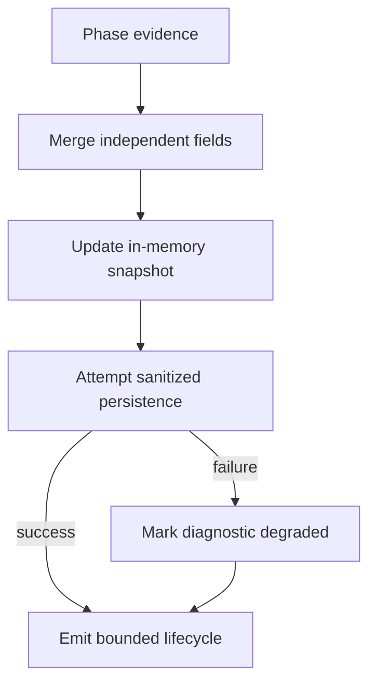

# F_DSN_STAGE — Architecture for C10-GCM03-S10-R04

## Objective

Complete R03 by replacing event-selection diagnostics with cumulative causal
state, containing every diagnostic-persistence failure, and closing the missing
deterministic decision/replay evidence while preserving the accepted Product and
transaction architecture.

Primary unit: C10-GCM03-S10-R04

Continuity alias: C10-GCM03-S09-R04

## 1. Responsibility map

| Responsibility | Owner | Constraint |
|---|---|---|
| Product semantic identity | domain Product | identity excludes user code |
| Incoming Product resolution | remote fact writer | retain R03 asymmetric table |
| Remote-to-local references | page applier/fact writer | map before dependent facts |
| Facts/inbox/cursor | Drift transaction | one atomic boundary |
| Apply translation | outer local-apply boundary | only after rollback |
| Causal operation state | operation recorder | cumulative, in memory first |
| Diagnostic persistence | attempt/event repository | best effort, non-authoritative |
| Core Sync result | coordinator | independent of diagnostic durability |
| Acknowledgement | coordinator/transport | only from committed cursor |
| Runner fallback | native runner | project cumulative truth, never overwrite it |
| UI/lifecycle | application/app | bounded state and sanitized class only |

## 2. Cumulative operation model

Use one recorder-owned state with independent dimensions, conceptually:

```text
phase: latestEntered + latestProved
provider: contact + transaction + trustedResponse
localApply: outcome + mutationState + cursorProof
diagnostics: begin + events + completion + degradation
acknowledgement: notStarted | started | classifiedResult
terminal: boundedResult + safeAction + retryable + sanitizedClass
metadata: already-authorized counts/sequences/fingerprints
```

The implementation need not expose this exact type publicly. It must provide one
coherent snapshot to the runner and deterministic tests.

## 3. Merge laws

Merge each dimension according to authority and monotonic knowledge, not event
arrival alone.



Required laws:

- later defaults/placeholders do not erase earlier proof;
- `trustedResponse=received` is retained;
- `localMutation=committed` or `rolled-back` is retained as transaction truth;
- acknowledgement state advances separately from download/apply state;
- terminal state adds a bounded result without replacing causal dimensions;
- persistence degradation accumulates from begin/event/completion;
- contradictory authoritative transaction claims produce a bounded invariant
  state, not silent last-writer wins.

Phase ordering must be explicit or carried as entered/proved fields. Do not infer
semantic strength from arbitrary strings or severity alone.

## 4. Recorder lifecycle

The operation recorder is created even if attempt creation fails.

```text
begin succeeds -> durable attempt available
begin fails    -> no attempt id + degraded=true

record phase:
  merge state synchronously
  attempt best-effort row write when possible
  on write failure set degraded=true
  emit lifecycle from cumulative state

complete:
  retain core outcome
  attempt best-effort completion
  on failure set degraded=true
  emit/project final cumulative state
```

The sink must not recursively record its own failure. Diagnostic persistence may
lag or be absent; the in-memory snapshot remains the runner's source for the
current operation.

## 5. Coordinator and acknowledgement ordering

The core order remains:

1. upload classification;
2. trusted download response;
3. page application and committed cursor;
4. acknowledgement eligibility;
5. acknowledgement request/result;
6. terminal projection.

A failed/unproved page returns before acknowledgement. A committed page remains
committed even if diagnostic rows cannot be written. An acknowledgement failure
changes only acknowledgement/provider knowledge and terminal guidance; it does
not reverse local facts/inbox/cursor.

Diagnostic recorder failure must not make a committed cursor unavailable to the
coordinator. Conversely, diagnostic success cannot supply a cursor or authorize
acknowledgement.

## 6. Product/apply architecture freeze

R04 is not a new resolver design.

Preserve:

- established incoming UUID strict immutable coherence;
- new UUID exact-identity convergence despite another local code;
- same-code/different-identity, split-key, and ambiguity conflicts;
- preserved local code/display;
- remote Product UUID to local Product UUID mapping;
- one Drift transaction and outer failure translation;
- bounded `sanitizedExceptionClass`.

Minimal test seams may expose a resolver decision or inject a writer failure.
They must not add an alias table, loosen a constraint, alter equality globally,
rewrite hosted facts, or move catches inside the transaction.

## 7. Failure taxonomy

Keep the R03 bounded categories:

- Product/Store identity conflict;
- SQLite/Drift database failure;
- payload/snapshot shape failure;
- local invariant failure;
- unexpected local-apply failure;
- diagnostics-persistence degradation.

The first five classify core apply. The last classifies observability only.
Never allow diagnostic degradation to masquerade as an apply category.

## 8. Test architecture

Prefer public/coordinator-level assertions for core ordering. Use focused fakes
for:

- attempt begin/event/completion failure;
- acknowledgement transport exception/result;
- arbitrary fact-writer exception;
- Product resolver ambiguity;
- two-page poison/replay sequence.

Every failure test should inspect, as applicable:

| Plane | Required observation |
|---|---|
| facts | inserted or absent |
| inbox | inserted or absent |
| cursor | advanced or unchanged |
| provider/trust | retained classification |
| diagnostics | durable/degraded independently |
| acknowledgement | not-started/started/result |
| terminal | bounded result and safe action |
| duplication | Product/Store/Purchase/Item cardinality |

Avoid tests that pass only because a diagnostic exception is swallowed.

## 9. Compatibility boundary

No change to:

- Drift schema/tables/migrations;
- hosted API, routes, payload v3, or event content;
- Auth0, enrollment, account/device binding, or Render/Neon configuration;
- dependencies or build configuration;
- Product selector UI behavior;
- Store convergence and Person/Payment restrictions;
- preserved client/provider data.

G/H/I must explicitly report these absences.

## 10. Completion boundary

R04 ends at committed source, deterministic validation, builds, and G/H/I.
Main must inspect and reconcile the actual commit before authorizing installation
or any human assay.

Even a fully passing R04 does not itself prove overall Sync. Practical acceptance
still requires corrected preserved-state clients, fresh read-only baselines,
one-client-at-a-time ordinary Sync, acknowledgement/postflight agreement, and a
separately authorized no-op replay.
