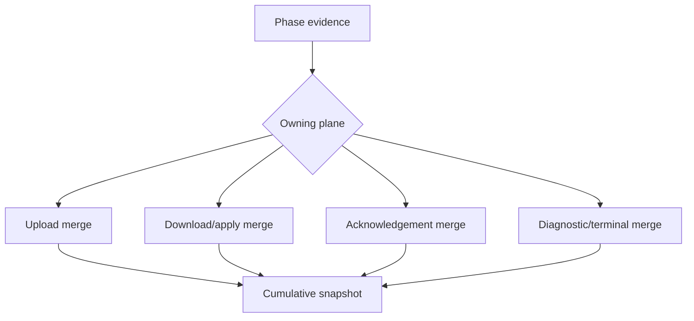

# F_DSN_STAGE — Architecture for C10-GCM03-S10-R05

## Objective

Complete the R04 causal recorder by partitioning transaction truth into upload,
download/inbound-apply, acknowledgement, diagnostic, and terminal planes. Keep
event-row compatibility, R03/R04 data convergence design, and all hosted
contracts unchanged.

Sequence: FLX-ORD-01

Primary unit: C10-GCM03-S10-R05

Continuity alias: C10-GCM03-S09-R05

## 1. Responsibility map

| Responsibility | Owner | Constraint |
|---|---|---|
| Upload request/provider result | UploadPendingEvents + transport | never used as ack proof |
| Upload lease/result persistence | outbox repository/use case | never used as inbound-apply proof |
| Download request/response | DownloadAndApplyEvents + transport | trusted response is page receipt only |
| Facts/inbox/cursor | remote applier Drift transaction | one atomic inbound-apply boundary |
| Acknowledgement | AcknowledgeAppliedCursor + transport | starts only from committed cursor |
| Cumulative operation truth | diagnostic operation recorder | independent typed/explicit planes |
| Durable diagnostic chronology | attempt/event repository | best effort; legacy row compatibility |
| Core Sync orchestration | HostedSyncCoordinator | stop ordering and eligibility |
| Runner fallback | NativeAuthClosureRunner | retain planes; add bounded terminal category |
| Lifecycle projection | runner/application | sanitized independent fields |
| Product identity/reference mapping | R03 fact writer/applier | frozen |

## 2. Cumulative state shape

Conceptually:

```text
operation
  phase
    latestEntered
    latestProved
  upload
    request
    trustedResponse
    providerOutcome
    leasePersistence
    resultPersistence
  download
    request
    trustedResponse
  inboundApply
    transactionOutcome
    cursorProof
  acknowledgement
    request
    trustedResponse
    outcome
  diagnostics
    durability
  terminal
    result
    safeAction
    retryable
    sanitizedExceptionClass
  metadata
    authorized counts/sequences/fingerprints
```

The code need not use these exact class or field names. The snapshot and tests
must expose equivalent independent semantics.

## 3. Event evidence versus cumulative truth

`SyncDiagnosticPhaseEvidence` currently carries generic fields suitable for one
phase event. `SyncDiagnosticEnvelope` stores those event rows.

R05 separates two roles:

1. event evidence describes the phase that emitted the row;
2. cumulative state describes the whole operation without collapsing distinct
   transactions.

Allowed compatibility strategies:

- add optional explicit plane fields to phase evidence and consume them in the
  cumulative recorder;
- introduce a recorder-internal typed event derived deterministically from phase
  and bounded evidence;
- use another equally explicit design with direct producer-to-plane tests.

Not allowed:

- continuing to treat one operation-wide `localMutationState` as both upload and
  inbound apply;
- continuing to treat one operation-wide `providerTransactionState` as both
  upload and acknowledgement;
- inferring acknowledgement success from the last generic provider value;
- adding a database migration solely to store cumulative fields.

## 4. Plane-scoped merge laws

Each plane has its own monotonic merge.



Within one plane:

- not-started may advance to started;
- response not-received may advance to received;
- unknown may advance to an authoritative result;
- terminal/default evidence cannot regress proof;
- incompatible authoritative results produce a bounded causal invariant.

Across different planes:

- outcomes coexist and never contradict merely because their strings differ;
- upload commit plus inbound rollback is valid;
- upload commit plus acknowledgement uncertainty is valid;
- inbound commit plus acknowledgement uncertainty is valid;
- diagnostic degradation adds observability state only.

## 5. Invariant ownership

An invariant requires two incompatible claims about the same authoritative
object or transition.

Valid invariant examples:

- the same inbound page transaction is authoritatively both committed and
  rolled-back;
- acknowledgement starts when inbound apply/cursor eligibility is failed or
  unproved;
- the same acknowledgement response is authoritatively both received and
  explicitly not received at the same completed transition.

Non-invariants:

- upload persistence commits, then inbound apply rolls back;
- upload provider commits, then acknowledgement transport is unknown;
- diagnostic persistence fails after inbound apply commits.

The bounded invariant category remains a safety result. R05 narrows its scope;
it does not remove it.

## 6. Coordinator ordering

The core order remains:

```text
authentication/binding
  -> upload lease/request/provider/result persistence
  -> download request/trusted response
  -> inbound apply facts/inbox/cursor transaction
  -> committed-cursor eligibility
  -> acknowledgement request/response/result
  -> terminal projection
```

Early-stop behavior remains:

- upload unknown/rejected blocks download and acknowledgement;
- inbound apply failed/rejected/rolled-back/unproved blocks acknowledgement;
- no later phase may manufacture skipped-phase proof.

Diagnostic failure never changes this ordering.

## 7. Runner and lifecycle projection

The recorder updates in memory before attempting durable diagnostic writes.

Both runner success and catch paths consume one snapshot API. Avoid reconstructing
truth from the caught exception or the last event.

Lifecycle output should expose bounded independent keys sufficient to
distinguish:

- upload provider and local persistence;
- download trusted response;
- inbound apply;
- acknowledgement request/response/outcome;
- diagnostic durability;
- terminal result and safe action.

Compatibility generic keys may remain, but they cannot be the only cumulative
truth or contradict the explicit keys.

## 8. Diagnostic persistence

R04 containment remains:

```text
begin failure -> recorder exists, durability degraded
row failure -> cumulative truth retained, durability degraded
complete failure -> core outcome retained, durability degraded
```

No diagnostic failure:

- rolls back or commits business data;
- changes provider evidence;
- changes acknowledgement eligibility;
- creates acknowledgement success;
- triggers recursive logging;
- starts Retry, Recovery, Query, or a second Sync.

## 9. Transaction and Product freeze

Do not modify:

- Product resolution decision table;
- remote-to-local Product reference map;
- Store convergence;
- Purchase/Purchase Item fact rules;
- facts/inbox/cursor Drift transaction;
- post-rollback exception translation;
- poison-page replay behavior;
- protocol-v3 Person/Payment restrictions.

R05 changes how operation truth is represented, not how remote facts converge.

## 10. Compatibility boundary

No change to:

- Drift tables, schema version, or migrations;
- hosted API routes, request/response bodies, event v3, or acknowledgement
  contract;
- Render/Neon/Auth0 configuration;
- enrollment or Account/Device binding;
- dependencies, generated code, or build configuration;
- installed Android/Windows databases or diagnostic history.

Old diagnostic rows remain historical event evidence. R05 must not claim they
contain newly introduced cumulative planes.

## 11. Test architecture

Use coordinator/runner-level fakes to execute complete compound sequences.

The primary matrix crosses:

| Upload | Inbound apply | Acknowledgement | Diagnostics | Expected |
|---|---|---|---|---|
| none | committed | applied | durable | completed/no-new-events |
| none | committed | throws | durable | apply retained; ack unknown |
| committed | rolled-back | not-started | durable | bounded core failure; no false invariant |
| committed | committed | throws | durable | upload/apply retained; ack unknown |
| unknown/rejected | not-started | not-started | durable | early stop |
| committed | committed | applied | degraded | core planes unchanged |
| committed | rolled-back | not-started | degraded | rollback retained; no false invariant |

Add a same-plane contradiction fixture separately. Do not manufacture it by
mixing legitimate outcomes from two transactions.

Every test should inspect downstream invocation counts and the independent
snapshot/lifecycle fields.

## 12. Security and diagnostic boundary

The new state carries categories, not data.

Never retain:

- event payloads or business facts;
- UUIDs or raw correlation/operation IDs;
- SQL, database values, filesystem paths, messages, or stacks;
- tokens, credentials, secrets, request hashes, or full hashes.

Keep only allow-listed codes/states, sanitized class names, short fingerprints,
safe counts/sequences, status classes, timing bands, and safe actions.

## 13. Completion boundary

R05 completes only:

- source truth-plane partition;
- direct compound deterministic evidence;
- regression and package validation;
- replacement G/H/I;
- one scoped implementation commit.

R05 does not complete practical Sync.

After Main reconciles R05, the next possible sequence is:

```text
read-only preserved-state checkpoint
  -> exact post-R05 build provenance
  -> separately authorized preserved-data installation
  -> second read-only post-install baseline
  -> one-client-at-a-time live assay
```

No step in that route is authorized by this F file.
